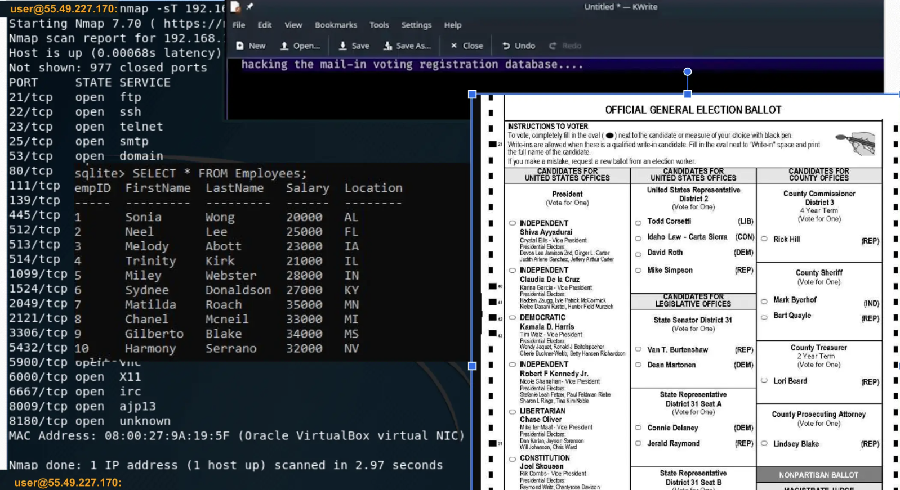

# Evidence E-001

**Type**: OSINT / external communication (screenshot)  
**Collected:**  
**Source**: Public post (KC7 dataset)  
**Confidence**: Low (unverified claim)  

**Extracted indicators (leads):**  
- Hacker's IP: 55.49.227.170  

**Notes**: Treat as a lead only.

