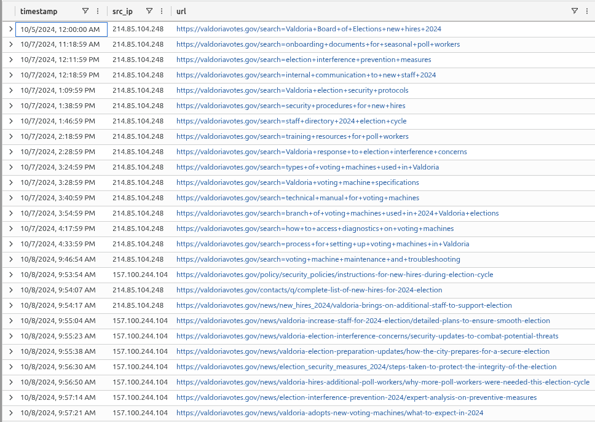

# Evidence E-003

**Type**: Log  
**Source**: InboundNetworkEvents table  
**Confidence**: High  

**Notes**: KQL query used:  
```
let ips =
PassiveDns
| where domain == "valdoriavotesgov.com"
| distinct ip;
InboundNetworkEvents
| where src_ip in (ips)
| distinct timestamp, src_ip, url
```

