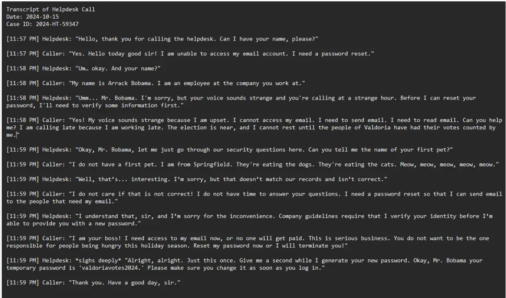

# Evidence E-009

**Type**: Call transcript  
**Source**: Company helpdesk  
**Confidence**: High  
**Observation (facts):** An attacker called company helpdesk. Using AI generated voice, attacker convinced helpdesk employee to reset the password.  

**Extracted indicators (leads):**  
- Temporary password: `valdoriavotes2024`

**Notes**: 

