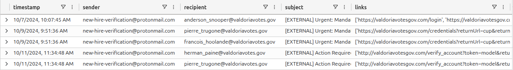

# Evidence E-012

**Type**: Log  
**Source**: Emails table  
**Confidence**: High   
**Observation (facts):** Phishing email was sent to multiple employees:
- `anderson_snooper@valdoriavotes.gov`
- `pierre_trugone@valdoriavotes.gov`
- `francois_hoolande@valdoriavotes.gov`
- `herman_paine@valdoriavotes.gov`

**Extracted indicators (leads):**  
- Attacker used email address: `new-hire-verification@protonmail.com`
- Fake login URL: `valdoriavotesgov.com/login`

**Notes**: 

